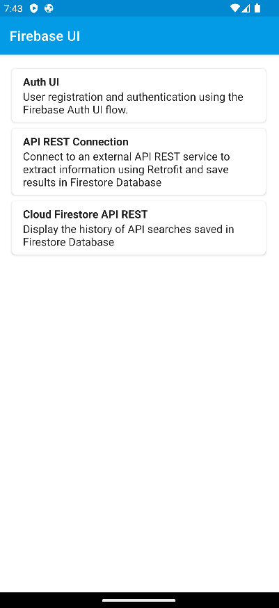
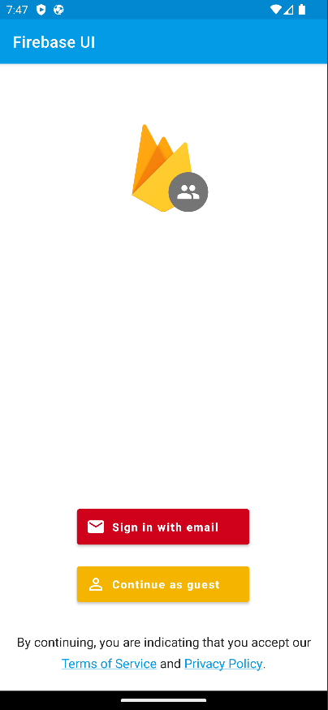
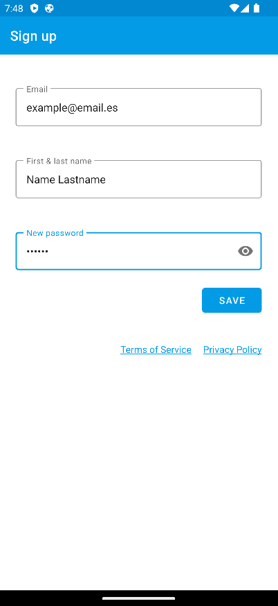
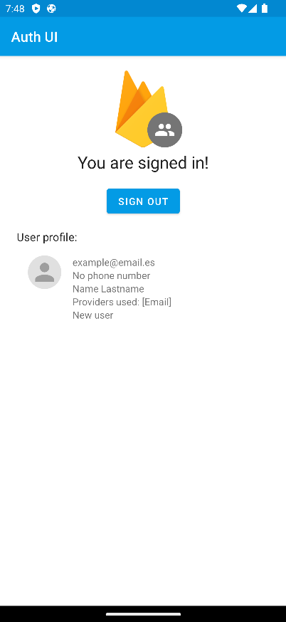
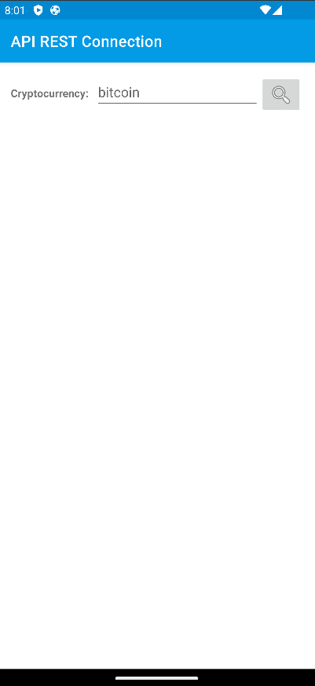
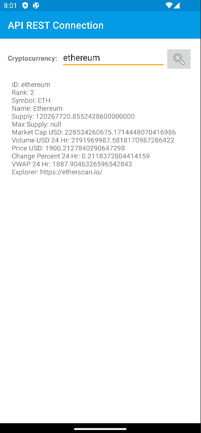

# Práctica Firebase: Autenticación, persistencia y conexión con servicios remotos

> https://github.com/oliver-upm/FirebaseUI-Android/tree/develop

> Desarrollado por Oliver Fernández García (@oliver-upm) para la asigantura de Front End para
> Móviles del Máster en Ingeniería Web de la UPM.

Partiendo del proyecto de [FirebaseUI-Android](https://github.com/firebase/FirebaseUI-Android) como
ejemplo, se han desarrollado las siguientes
funcionalidades acorde a lo requerido en la práctica:

## Registro y autenticación de usuarios

Utilizando el servicio [Firebase Authentication](https://firebase.google.com/docs/auth) se
proporciona
la posibilidad de registrar nuevos usuarios y autenticarlos mediante email y contraseña. Asismismo,
existe las posibilidad de ingresar como invitado.

## Conectar a un servicio API externo

La API elegida es la de [CoinCap](https://coincap.io/): **[CoinCap API 2.0](https://docs.coincap.io/)**.
Proporciona datos transparentes y precisos sobre precios y actividad de mercado en tiempo real para
más de 1000 criptomonedas.

Para el ejemplo **no** se utiliza autenticación ya que esta API proporciona de forma gratis hasta un
límite de 200 peticiones por minuto y 11 años de datos históricos.

Esta funcionalidad permite hacer peticiones asíncronas a la API
utilizando [Retrofit](https://square.github.io/retrofit/) para, mediante el nombre de la
criptomoneda, obtener información sobre su precio, market cap, porcentaje de cambio en las últimas
24 horas, etc. Además, cada búsqueda se almacena en la base de
datos [Cloud Firestore](https://firebase.google.com/docs/firestore) para poder acceder a ellas en la
siguiente funcionalidad.

## Persistencia: Mostrar historial de búsquedas
Utilizando los datos almacenados en la base de datos Cloud Firestore, se muestra el historial de las
últimas 20 búsquedas realizadas ordenadas por fecha de búsqueda (de más reciente a más antigua).
Así el usuario puede comparar los datos de las criptomonedas en diferentes momentos.

# DEMO
[Video demostrativo de la aplicación](https://drive.google.com/file/d/1qDokcClBjEPuiCF8dYVO1AQokBve7Eaa/view?usp=sharing)